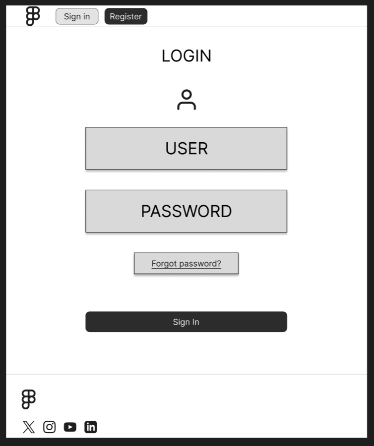

# SPRINT 2

# Disseny base de dades
---

## Taula: `User`

Taula que emmagatzema informació dels estudiants.

| Columna       | Tipus            | Descripció                                          |
|---------------|------------------|-----------------------------------------------------|
| `id`          | `INT`            | Clau primària, identificador únic de l’estudiant.   |
| `name`        | `VARCHAR(255)`   | Nom de l’estudiant.                                 |
| `lastName`    | `VARCHAR(255)`   | Cognom de l’estudiant.                              |
| `class_group` | `VARCHAR(50)`    | Grup o classe a què pertany l’estudiant.            |
| `email`       | `VARCHAR(255)`   | Correu electrònic de l’estudiant (opcional).        |
| `phone`       | `BIGINT`         | Número de telèfon de l’estudiant (opcional).        |

---

## Taula: `Teacher`

Taula que emmagatzema informació dels professors.

| Columna       | Tipus            | Descripció                                          |
|---------------|------------------|-----------------------------------------------------|
| `id`          | `INT`            | Clau primària, identificador únic del professor.    |
| `name`        | `VARCHAR(255)`   | Nom del professor.                                  |
| `lastName`    | `VARCHAR(255)`   | Cognom del professor.                               |
| `email`       | `VARCHAR(255)`   | Correu electrònic del professor (opcional).         |
| `phone`       | `BIGINT`         | Número de telèfon del professor (opcional).         |

---

## Taula: `Subject`

Taula que emmagatzema informació sobre les assignatures.

| Columna       | Tipus            | Descripció                                          |
|---------------|------------------|-----------------------------------------------------|
| `id`          | `INT`            | Clau primària, identificador únic de l’assignatura. |
| `name`        | `VARCHAR(255)`   | Nom de l’assignatura.                               |

---

## Taula: `Assistance`

Taula que emmagatzema els registres d’assistència dels estudiants, incloent-hi l'estat d'assistència, la data i la relació amb els estudiants, professors i assignatures.

| Columna            | Tipus            | Descripció                                               |
|--------------------|------------------|----------------------------------------------------------|
| `id`               | `INT`            | Clau primària, identificador únic del registre d’assistència. |
| `userID`           | `INT`            | Clau forana que fa referència a `id` a la taula `User`.         |
| `teacherID`        | `INT`            | Clau forana que fa referència a `id` a la taula `Teacher`.      |
| `subjectID`        | `INT`            | Clau forana que fa referència a `id` a la taula `Subject`.      |
| `attendance_status`| `ENUM`           | Estat d’assistència de l’estudiant. Valors possibles: 'present', 'absent', 'justified'. |
| `date`             | `DATETIME`       | Data i hora del registre d’assistència. S’assigna automàticament la data actual. |

---

## Relacions entre les Taules

- La taula `Assistance` conté claus foranes (`userID`, `teacherID`, `subjectID`) que creen relacions amb les taules `User`, `Teacher` i `Subject`, respectivament.
- Aquestes relacions permeten registrar l’assistència de cada estudiant en una assignatura específica, impartida per un professor específic, juntament amb l’estat d’assistència i la data del registre.

---
# Documentación de Pruebas para la Base de Datos

## Insertar Datos de Prueba

Se han insertado los siguientes datos de prueba en las tablas `User`, `Teacher`, `Subject` y `Assistance`:

### Tabla `User`
```sql
INSERT INTO User (name, lastName, class_group, email, phone)
VALUES
('Juan', 'Pérez', 'DAM1', 'juan.perez@mail.com', 600123456),
('María', 'Gómez', 'DAM2', 'maria.gomez@mail.com', 600654321);
```

**Resultado:**


### Tabla `Teacher`
```sql
INSERT INTO Teacher (name, lastName, email, phone)
VALUES
('Carlos', 'Lopez', 'carlos.lopez@mail.com', 600987654),
('Ana', 'Martínez', 'ana.martinez@mail.com', 600321098);
```

**Resultado:**


### Tabla `Subject`
```sql
INSERT INTO Subject (name)
VALUES
('Matemáticas'),
('Programación');
```

**Resultado:**


### Tabla `Assistance`
```sql
INSERT INTO Assistance (userID, teacherID, subjectID, attendance_status)
VALUES
(1, 1, 1, 'present'),
(2, 1, 1, 'absent'),
(1, 2, 2, 'justified');
```

**Resultado:**


### Consultas para Pruebas

### a) Consultar asistencias de un estudiante
```sql
SELECT u.name AS 'Estudiante', s.name AS 'Asignatura', a.attendance_status AS 'Estado', a.date AS 'Fecha'
FROM Assistance a
JOIN User u ON a.userID = u.id
JOIN Subject s ON a.subjectID = s.id
ORDER BY a.date;
```

**Resultado:**


### b) Consultar la asistencia por asignatura
```sql
SELECT s.name AS 'Asignatura', COUNT(a.id) AS 'Total Asistencias',
       SUM(a.attendance_status = 'present') AS 'Presentes',
       SUM(a.attendance_status = 'absent') AS 'Ausentes',
       SUM(a.attendance_status = 'justified') AS 'Justificados'
FROM Assistance a
JOIN Subject s ON a.subjectID = s.id
GROUP BY s.name;
```

**Resultado:**


### c) Verificar asistencia de un profesor
```sql
SELECT t.name AS 'Profesor', s.name AS 'Asignatura', u.name AS 'Estudiante', a.attendance_status AS 'Estado', a.date AS 'Fecha'
FROM Assistance a
JOIN Teacher t ON a.teacherID = t.id
JOIN Subject s ON a.subjectID = s.id
JOIN User u ON a.userID = u.id
WHERE t.id = 1;
```

**Resultado:**


# Wireframe

## Part DAW

[Link figma](https://www.figma.com/design/GhoUdr6eW2mQHnZMafSNAA/Untitled?node-id=0-1&node-type=canvas&t=bO3nDgOnIfGhOwH8-0)

### Login

La pàgina del login consta d'un formulari amb:
- Label per el email
- Input per el email
- Label per la contrasenya
- Botó per enviar la petició del formulari
- Link per recuperar contrasenya


### Home

#### Versió de mobil

La pàgina inicial mostra l'última vegada que es va fitxar i les proximes assignatures.

#### Versió d'ordinador

La pàgina inicial mostra l'última vegada que es va fitxar, les proximes assignatures i una grella amb l'horari.

`Versió dels alumnes:`


`Versió dels professors: `


### Asistències

#### Versió dels alumnes

Aquesta pàgina mostra una taula amb totes les assistències amb el nom de les assignatures, dates i tipus d'assistencia.

`Versió dels alumnes: `


#### Versió dels professors

La part d'asistències del professorat consta de dos parts:

- Selecció de la clase
- Asistències de la clase

##### Selecció de la clase

A aquesta pàgina es mostra una taula amb les clases disponibles del professor amb un link per pasar llista a aquesta clase.


##### Asistències de la clase

A aquesta pàgina es mostra una taula amb les asistències dels alumnes que pertanyen a la clase amb el nom, data i tipus de asistència.


### Horari

La pàgina del horari consta de una graella amb l'horari del usuari.


`Versió Alumne: `


`Versió professorat: `


